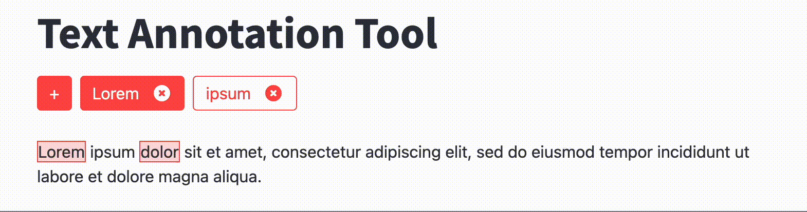

<h1> streamlit-annotation </h1>

- [Streamlit Annotation Tools](#streamlit-annotation-tools)
- [Demo](#demo)
  - [Try](#try)
  - [Text Highlighter](#text-highlighter)
  - [Text Labeler](#text-labeler)
- [Install](#install)
- [Quick Use](#quick-use)
  - [Text Highlighter](#text-highlighter-1)
  - [Text Labeler](#text-labeler-1)
- [Development](#development)
  - [Install](#install-1)
  - [Run](#run)
- [License](#license)
- [Author](#author)
- [Contributors](#contributors)

# Streamlit Annotation Tools

[](https://badge.fury.io/py/streamlit-annotation-tools)
[](https://pepy.tech/project/streamlit-annotation-tools)
[](https://pepy.tech/project/streamlit-annotation-tools)
[](https://pepy.tech/project/streamlit-annotation-tools)

Streamlit Annotation Tools is a Streamlit component that gives you access to various annotation tools (labeling, annotation, etc.) for text data.

# Demo

## Try
[](https://annotation-tools.streamlit.app/)

## Text Highlighter


## Text Labeler


# Install

```
pip install streamlit-annotation-tools
```

# Quick Use

## Text Highlighter

Create an example.py file

```python
from streamlit_annotation_tools import text_highlighter

text = "Lorem ipsum dolor sit amet, consectetur adipiscing elit. Aenean et hendrerit orci. Praesent auctor malesuada lobortis. Suspendisse ac elit bibendum, congue tellus vel, ornare ipsum. Mauris at tellus in turpis aliquet cursus."

annotations = text_highlighter(text)
```

Run:

```
streamlit run example.py
```

Output:

```python
[
  [
    {"start": 0, "end": 5, "label": "Lorem"},
    {"start": 12, "end": 17, "label": "dolor"},
  ],
  [
    {"start": 6, "end": 11, "label": "ipsum"},
    {"start": 18, "end": 21, "label": "sit"},
  ],
]
```

## Text Labeler

Create an example.py file

```python
from streamlit_annotation_tools import text_labeler

text = "Yesterday, at 3 PM, Emily Johnson and Michael Smith met at the Central Park in New York to discuss the merger between TechCorp and Global Solutions. The deal, worth approximately 500 million dollars, is expected to significantly impact the tech industry. Later, at 6 PM, they joined a conference call with the CEO of TechCorp, David Brown, who was in London for a technology summit. During the call, they discussed the market trends in Asia and Europe and planned for the next quarterly meeting, which is scheduled for January 15th, 2024, in Paris."

labels = text_labeler(text)
```

Run:

```
streamlit run example.py
```

Output:

```python
{
    "Personal names": [
        {"start": 20, "end": 33, "label": "Emily Johnson"},
        {"start": 38, "end": 51, "label": "Michael Smith"},
        {"start": 327, "end": 338, "label": "David Brown"},
    ],
    "Organizations": [
        {"start": 118, "end": 126, "label": "TechCorp"},
        {"start": 131, "end": 147, "label": "Global Solutions"},
    ],
    "Locations": [
        {"start": 63, "end": 75, "label": "Central Park"},
        {"start": 79, "end": 87, "label": "New York"},
        {"start": 351, "end": 357, "label": "London"},
        {"start": 436, "end": 440, "label": "Asia"},
        {"start": 445, "end": 451, "label": "Europe"},
        {"start": 542, "end": 547, "label": "Paris"},
    ],
    "Time": [
        {"start": 0, "end": 9, "label": "Yesterday"},
        {"start": 14, "end": 18, "label": "3 PM"},
        {"start": 265, "end": 269, "label": "6 PM"},
        {"start": 519, "end": 531, "label": "January 15th"},
        {"start": 533, "end": 537, "label": "2024"},
    ],
    "Money": [{"start": 179, "end": 198, "label": "500 million dollars"}],
}
```

# Development

## Install

```
git clone git@github.com:rmarquet21/streamlit-annotation-tools.git
cd streamlit-annotation-tools
pip install -e .
```

## Run

```
streamlit run example.py
```

# License

MIT

# Author

Robin Marquet

# Contributors

- [Robin Marquet](robin.marquet3@gmail.com)

