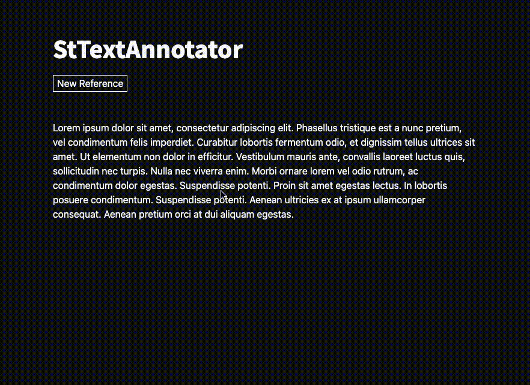

<h1> streamlit-annotation </h1>

- [Install](#install)
- [Quick Use](#quick-use)
- [Development](#development)
  - [Install](#install-1)
  - [Run](#run)
- [License](#license)
- [Author](#author)
- [Contributors](#contributors)

# Streamlit Text Annotator

[](https://badge.fury.io/py/st-text-annotator)
[](https://pepy.tech/project/st-text-annotator)
[](https://pepy.tech/project/st-text-annotator)
[](https://pepy.tech/project/st-text-annotator)

Streamlit Text Annotator is a Streamlit component that allows you to annotate text.



# Install

```
pip install st-text-annotator
```

# Quick Use

Create an example.py file

```python
from st_text_annotator import StTextAnnotator

text = "Lorem ipsum dolor sit amet, consectetur adipiscing elit. Aenean et hendrerit orci. Praesent auctor malesuada lobortis. Suspendisse ac elit bibendum, congue tellus vel, ornare ipsum. Mauris at tellus in turpis aliquet cursus."

StTextAnnotator(text)
```

Run:

```
streamlit run example.py
```

Output:

```json
{
  "annotations": [
    [
      {
        "start": 0,
        "end": 5,
        "label": "Lorem"
      },
      {
        "start": 12,
        "end": 26,
        "label": "dolor sit amet"
      },
      {
        "start": 130,
        "end": 148,
        "label": "Curabitur lobortis"
      },
      {
        "start": 309,
        "end": 319,
        "label": "nec turpis"
      }
    ]
  ]
}
```

# Development

## Install

```
git clone git@github.com:rmarquet21/streamlit-text-annotator.git
cd streamlit-text-annotator
pip install -e .
```

## Run

```
streamlit run example.py
```

# License

MIT

# Author

Robin Marquet

# Contributors

- [Robin Marquet](robin.marquet3@gmail.com)

